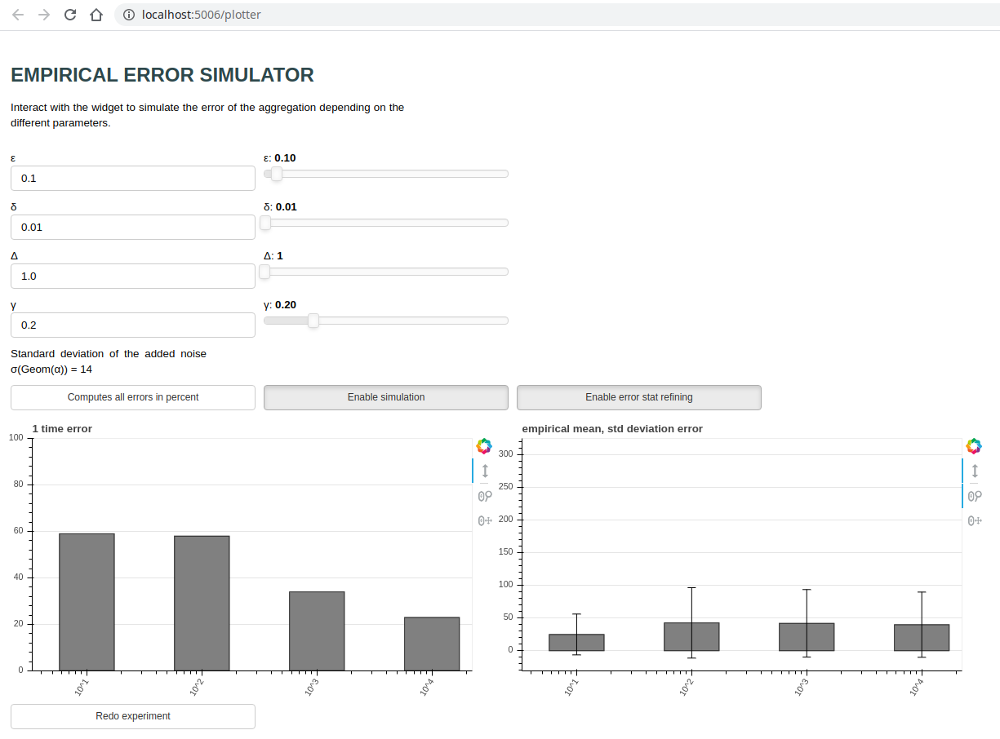

# POC for the Privacy-Preserving Aggregation of Time-Series Data paper from ndss2011

Implementating the summation protocol presented.

## Project structure

A backend part made out of:

```
.
├── poc
│   ├── aggregator
│   ├── cipher_basic
│   ├── cipher_intuition  # not used
│   ├── participant
│   └── ttp
└── main  # contains an example to run an experiment
```

And a front to generate experiments and study the behavior of the noise and the error.  
You need to have bokeh installed to use it. (`pip3 install --user bokeh`)

```
.
└── poc
    ├── error_plot.html  # template, do not open as is
    └── plotter

```

## Run the main experiment

The main experiment features 120 participants who pick random values up. They send them to the aggregator and the aggregator sum them and print the result.

```bash
python3 main.py
```

## Frontend

### Run the frontend

```bash
 python3 -m bokeh serve --show poc/plotter.py
 ```



### How to use the frontend

The frontend let you tune the different parameters of the experiment and see how the error changes.
2 graphs are made:

- the aggregation for 10, 100, 1000 and 10000 participants, 1 experiment for each group. The absolute value of the error is displayed as a bar.

- The error for the 3 sizes of experiment: mean error (absolute value) and standard deviation.

The second graph will be computed dynamically and refining as time goes. If you change the parameters, it is recomputed from scratch (because the mean and std dev will change). To enable the computation, make sure that the "Enable stat refining" is pressed.  
The enable simulation button let you compute the left graph. If you use the sliders to change the parameters, you need to press the button again.  
One last button let you compute the graph using the percentage error.  
One major result to get from these graph is that the mean error and standard deviation is constant (relatively to the number of participants). You can get this result by looking at the right graph after some time (without error in percent). This means that the error in percent decreases with the number of participants as 1/n.  

### Reminder: parameters semantic

- ε,δ: parameters for the differential privacy

- Δ: maximum value for a value of a participant (participants will pick values in range {0, Δ})

- γ: ratio of trusted participants ([0,1]). γ<-5 means that the participants will consider that half of the participants will be trustworthy (to distributed the noise)

## Run tests

```bash
python3 -m unittest poc.tests.test_ttp
```
